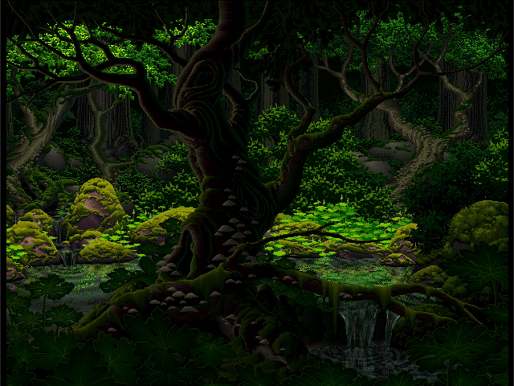
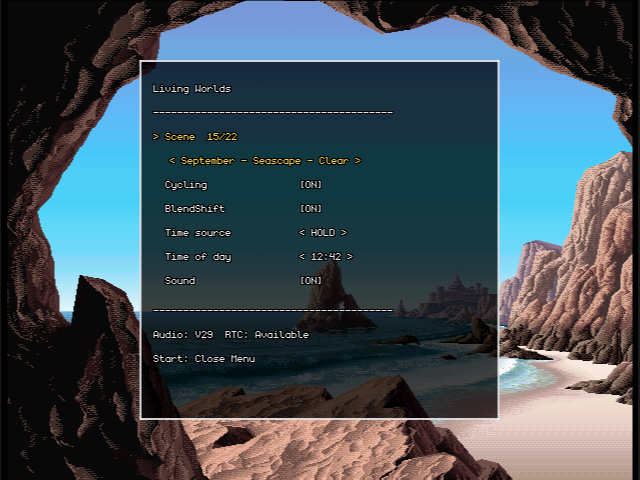

# Living Worlds (N64)

A libdragon port of [Living Worlds](http://www.effectgames.com/demos/worlds/)
— Mark Ferrari's color-cycling pixel art running on Nintendo 64 via the CI8
texture format and per-frame TLUT animation.


| Description | Screenshot |
| :---: | :---: |
| **Sample Scene** |  |
| **Menu Options** |  |

## Building

### 1. Prerequisites

- **libdragon toolchain** installed and `N64_INST` exported.
- **Python 3** for the asset-fetching and scene-conversion scripts.
- A working internet connection to fetch the assets.

### 2. Clone with the libdragon submodule

```sh
git clone --recurse-submodules https://github.com/meeq/living-worlds-n64.git
cd living-worlds-n64
```

If you already cloned without `--recurse-submodules`:

```sh
git submodule update --init
```

The `libdragon/` submodule tracks the `DragonMinded/libdragon` repo `preview`
branch and is checked out for source reference; the build itself links against
`$N64_INST`, not the submodule.

To setup libdragon, see [libdragon/README.md](./libdragon/README.md).

### 3. Fetch assets

This repo does **not** include scene or audio assets — they're pulled from the
upstream reference demo on first build. Two one-shot targets:

```sh
make scenes   # JSONP scene payloads -> scenes/*.js
make sounds   # ambient MP3 loops    -> sounds/*.mp3
```

Both scripts skip files that already exist; pass `--force` to re-download.
`scenes.json` (the per-scene metadata catalog) is committed so you don't
need to regenerate it, but you can with `tools/fetch-catalog.py`.

### 4. Build the ROM

```sh
make
```

### 5. Run

Run `living-worlds.z64`:

- **Emulator:** Ares or Gopher64 (other emulators may not be accurate enough).
- **Hardware:** Runs on Nintendo 64, Analogue3D, and ModRetro M64.

The ROM header configures the `eeprom4k` save type and enables the RTC.

## Project Layout

```
src/                   # C source code
Makefile               # build pipeline
scenes.json            # scene catalog (regenerated by tools/fetch_catalog.py)
scenes/                # fetched JSONP payloads (see tools/fetch_scenes.py)
sounds/                # fetched MP3 loops (see tools/fetch_scenes.py)
filesystem/            # build outputs that go into the DFS image (gitignored)
tools/                 # asset fetching + scene-conversion scripts
libdragon/             # submodule: DragonMinded/libdragon @ preview
```

## Housekeeping

```sh
make clean   # deletes build artifacts
```

Scene and sound caches under `scenes/` and `sounds/` are kept so subsequent
builds don't re-download. Delete those directories manually for a fully clean
state.

## Credits

* **Artwork:** Mark Ferrari
* **Original Code:** Ian Gilman & Joseph Huckaby
* **Nintendo 64 Port:** Christopher Bonhage
